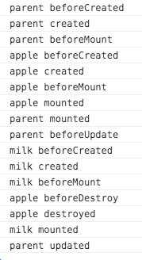
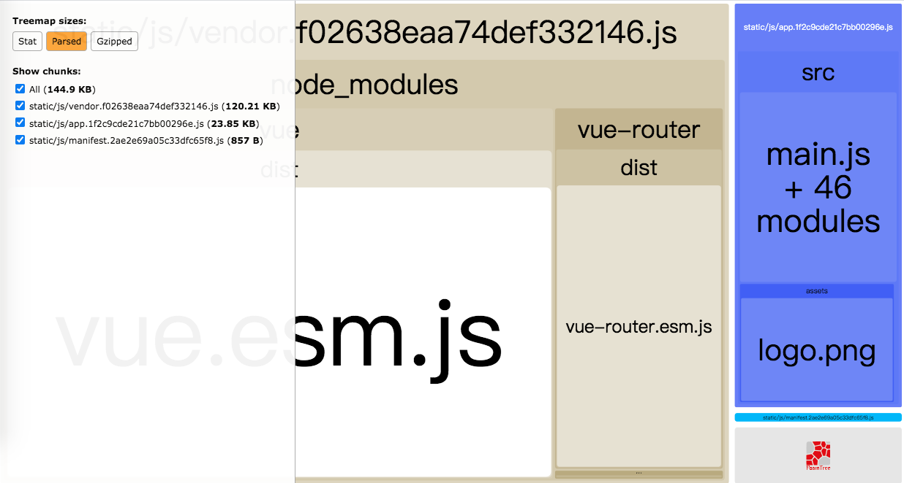
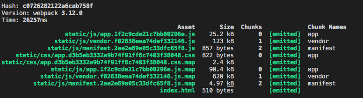
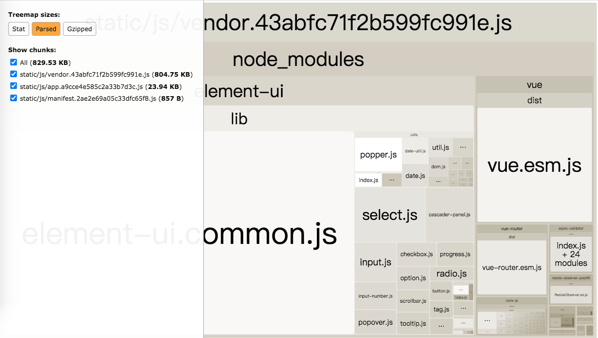
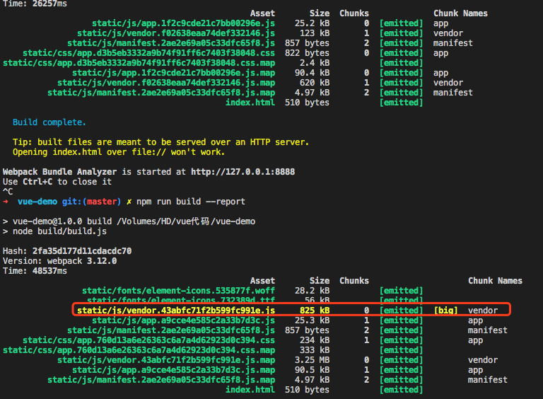
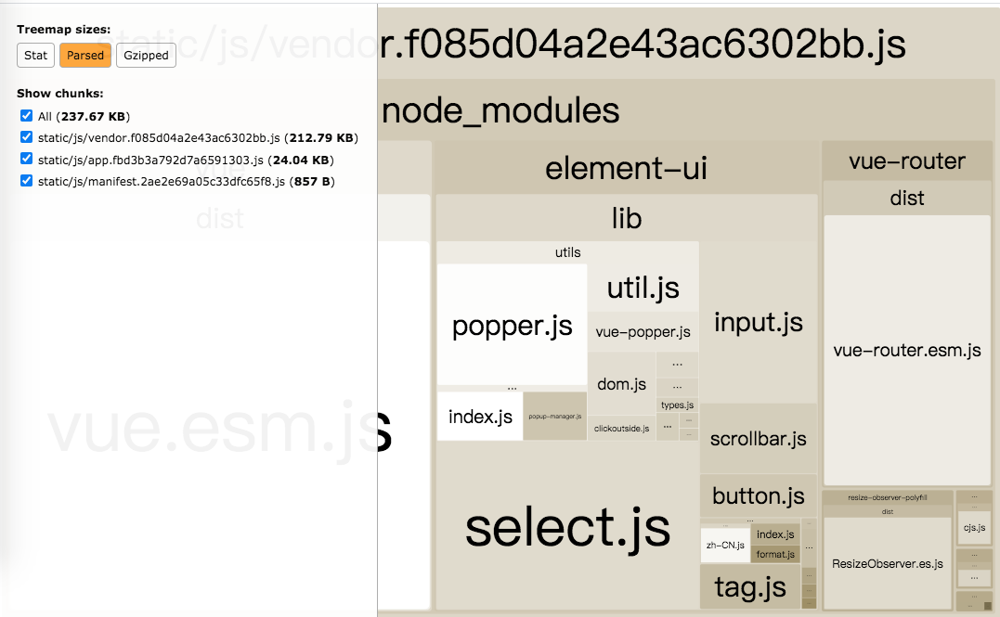
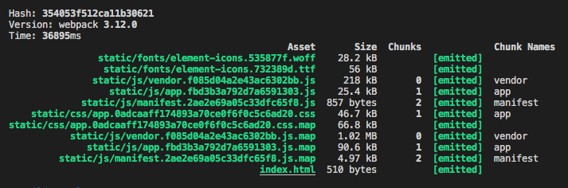

# vue-demo

## `passDataProp` -- 父子组件通过`prop`进行传值

父子组件通过`prop`异步传输数据，子组件无法响应父组件传值
场景：父组件在`mounted`钩子函数中发起`http`请求获取数据，将获取到的数据赋值给本地`data`对象的属性上。然后通过`prop`将数据传递给子组件，子组件在`mounted`钩子函数将父组件传递过来的值赋值给本地`data`对象的属性上。结果，子组件无法渲染父组件传递过来的数据。看到这里是不是有一丢丢的熟悉，是的，在`prop`传输数据里也提到过这个问题。

> 二者区别在于：如果父组件不是异步请求数据，子组件会成功渲染一次，父组件数据改变子组件不会同步更新。如果父组件是异步请求数据，子组件一次都不会成功渲染。

解决方案：

+ 如果子组件接受父组件传递过来的值只是展示，不做转换，可以直接渲染父组件传过来的值，即可实时更新。

+ 如果子组件接受父组件传递过来的值经过转换展示，将`prop`赋值给子组件的`data`对象的属性，再用`watch`监听`prop`，`prop`改变后即时更新data对象上的属性。

> 注意：对象深层嵌套watch中加`deep:true`。

缺点: `watch`深度监听，如果监听的对象数据比较多，性能有损耗。

## 父子组件的生命周期

打印出日志如下：

```text
I am parents beforeCreated
I am parents created
I am parents beforeMount
I am child1 beforeCreated
I am child1 created
I am child1 beforeMount
I am child2 beforeCreated
I am child2 created
I am child2 beforeMount
I am child3 beforeCreated
I am child3 created
I am child3 beforeMount
I am child4 beforeCreated
I am child4 created
I am child4 beforeMount
I am child1 mounted
I am child2 mounted
I am child3 mounted
I am child4 mounted
I am parents mounted
I am parents beforeUpdate
I am child1 beforeUpdate
I am child2 beforeUpdate
I am child3 beforeUpdate
I am child4 beforeUpdate
I am child4 updated
I am child3 updated
I am child2 updated
I am child1 updated
I am parents updated
I am parents beforeDestroy
I am child1 beforeDestroy
I am child1 destroyed
I am child2 beforeDestroy
I am child2 destroyed
I am child3 beforeDestroy
I am child3 destroyed
I am child4 beforeDestroy
I am child4 destroyed
I am parents destroyed
```

总结：父子组件生命周期如下

父组件beforeCreated → 父组件created → 父组件beforeMount → 子组件beforeCreated → 子组件created → 子组件beforeMount → 子组件mounted → 父组件mounted → 父组件beforeUpdate → 子组件beforeUpdate → 子组件updated → 父组件updated → 父beforeDestroy→ 子组件beforeDestroy → 子组件destroyed → 父组件destroyed

## 路由

### 路由跳转页面的方法

【1】直接修改地址栏地址

【2】在页面中点解路由跳转链接

【3】在代码逻辑中跳转

### 路由分类

根据是否跳转新的页面：

+ 跳转新页面路由
  + 普通路由
  + 重定向路由
+ 不跳转新页面路由
  + 动态路由
  + 嵌套路由：动态路由 + 子路由

```text
  动态路由 VS 嵌套路由
  ①对于同一组件，动态路由不同的地方比较少，嵌套路由不同的地方比较多
  ②嵌套路由实际上是动态路由和子路由的组合
```

### 动态路由匹配

【1】特点：同一个组件，局部不同。例如：User组件。路由切换时，组件不变，只改变用户id

【2】用法：用:来表示动态路径的参数

```javascript
const router = new VueRouter({
  routes: [
    // 动态路径参数 以冒号开头
    { path: '/user/:id', component: User }
  ]
})
```

【3】组件内获取动态路由参数：`this.$route.params`

【4】响应路由参数的变化

> 使用`路由参数`时，原来的组件实例会被复用。因为两个路由渲染同一个组件，比起销毁再创建，复用更高效，但是也因此，组件的生命周期beforeCreated、created、beforeMount、mounted不会再调用，只调用beforeUpdate、update。

因此，常规方法并不能检测到路由的跳转

解决方案：

① 用 watch 监听 $route 对象

```javascript
watch: {
  $route(to, from) {
    // 对路由变化作出响应...
    console.error(to)
    console.error(from)
  }
}
```


② 用 beforeRouteUpdate

```javascript
beforeRouteUpdate (to, from, next) {
  // react to route changes...
  // don't forget to call next()
}
```

### 嵌套路由

【1】特点：不同的组件在同一位置

【2】用法：在`route`中配置 `children`属性

```javascript
{
  path: '/product',
  name: 'product',
  component: Product,
  children: [
    {
      path: 'milk',
      name: 'milk',
      component: Milk
    },
    {
      path: 'apple',
      name: 'apple',
      component: Apple
    }
  ]
}
```

【3】在父组件加载子组件的位置添加`<router-view></router-view>`

【4】子组件的引入方式

① `import` 到父组件中，再注册到`components` 属性上

> 子组件不在同一位置上

② 通过子路由方式

> 子组件在同一位置

【5】嵌套路由的生命周期



### 编程式导航

```text
  `$router` vs `$route`
  `$router`是路由实例，`$route`是`routes`中的一个`route`
```

> 在 vue 实例中，可通过`$router`访问路由实例

路由实例的方法：`this.$router.push()`

> 这个方法会向history栈添加一个新记录，可回退到之前的url

注意： 该方法的参数同`<router-link></router-link>`中`to`的属性相同

该方法或to属性的属性值有多种情况，如下：

+ 字符串

  + 子路由

  + 根级别的路由

+ 对象：如果对象作为`to`的属性值，`to`属性必须为动态属性

  + 有`path`属性的对象

  + 有`path`属性且属性值为变量的对象

  + 有`name`属性的对象

  + 有`name`属性和`params`属性的对象

  + 有`path`属性和`query`属性的对象

  + 有`name`属性和`query`属性的对象

> path 和 name 使用其中一个即可；如果提供了path，params会被忽略

路由传参的方式有：`query` 和 `params`

两者的区别：

+ `query`通过`path`或`name`切换路由，`params`只能通过`name`切换路由

+ `query`通过`this.$route.query`来接收参数，`params`通过`this.$route.params`来接收参数

+ `params`一旦设置在路由，就是路由的一部分。

  params是路由的一部分,必须要在路由后面添加参数名。query是拼接在url后面的参数，没有也没关系。如果这个路由有params传参，但是在跳转的时候没有传这个参数，会导致跳转失败或者页面会没有内容。

+ `params`的`route`是动态路由，`query`的`route`是普通路由

+ `query`传参的以`url`的方式展示，`params`传参以动态路由`url`的方式展示

+ `query`相当于`get`请求，页面跳转的时候，可以在地址栏看到请求参数，而`params`相当于`post`请求，参数不会再地址栏中显示.

  示例代码见 `/src/components/routerDemo/product.vue`

### 懒加载

#### 路由懒加载

#### 组件懒加载

#### 第三方组件库按需引入

以`element-ui`为例，操作如下：

【1】安装

```bash
npm i element-ui -S
```

执行 `npm run build --report`，查看初始体积，如下：




> vendor.js是第三方库的集成，也就是我们在package.json中"dependencies"对象中的那些库以及一些必须的第三方库

由图可知，初始时，vendor的初始体积为123kb，main.css 的初始体积为822bytes

【2】全局引入，在`main.js`中写入

```javascript
import ElementUI from 'element-ui';
import 'element-ui/lib/theme-chalk/index.css';

Vue.use(ElementUI);
```

执行 `npm run build --report`，查看全局引入体积，如下：




由图可知，vendor的体积变为了825kb，main.css 的体积变为了234kb，呃。。。好大！

【3】按需引入组件

借助 babel-plugin-component，我们可以只引入需要的组件，以达到减小项目体积的目的。

首先，安装 babel-plugin-component：

```bash
npm install babel-plugin-component -D
```

然后，将 .babelrc 修改为：

```babel
{
  "presets": [["es2015", { "modules": false }]],
  "plugins": [
    [
      "component",
      {
        "libraryName": "element-ui",
        "styleLibraryName": "theme-chalk"
      }
    ]
  ]
}
```

如果你只希望引入部分组件，比如 Button 和 Select，那么需要在 main.js 中写入以下内容：

```javascript
import { Button, Select } from 'element-ui';
// 注意：不需要再单独引入样式
Vue.component(Button.name, Button);
Vue.component(Select.name, Select);
/* 或写为
 * Vue.use(Button)
 * Vue.use(Select)
 */
```

执行 `npm run build --report`，查看按需引入体积，如下：




由图可知，vendor的体积变为了218kb，main.css 的体积变为了46.7kb

由此可见，按需引入大大的减少了打包后的体积。
