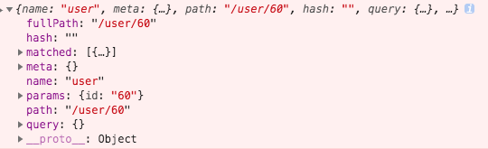

# vue-demo

## `passDataProp` -- 父子组件通过`prop`进行传值

父子组件通过`prop`异步传输数据，子组件无法响应父组件传值
场景：父组件在`mounted`钩子函数中发起`http`请求获取数据，将获取到的数据赋值给本地`data`对象的属性上。然后通过`prop`将数据传递给子组件，子组件在`mounted`钩子函数将父组件传递过来的值赋值给本地`data`对象的属性上。结果，子组件无法渲染父组件传递过来的数据。看到这里是不是有一丢丢的熟悉，是的，在`prop`传输数据里也提到过这个问题。

> 二者区别在于：如果父组件不是异步请求数据，子组件会成功渲染一次，父组件数据改变子组件不会同步更新。如果父组件是异步请求数据，子组件一次都不会成功渲染。

解决方案：

+ 如果子组件接受父组件传递过来的值只是展示，不做转换，可以直接渲染父组件传过来的值，即可实时更新。

+ 如果子组件接受父组件传递过来的值经过转换展示，将`prop`赋值给子组件的`data`对象的属性，再用`watch`监听`prop`，`prop`改变后即时更新data对象上的属性。

> 注意：对象深层嵌套watch中加`deep:true`。

缺点: `watch`深度监听，如果监听的对象数据比较多，性能有损耗。

## 父子组件的生命周期

打印出日志如下：

```text
I am parents beforeCreated
I am parents created
I am parents beforeMount
I am child1 beforeCreated
I am child1 created
I am child1 beforeMount
I am child2 beforeCreated
I am child2 created
I am child2 beforeMount
I am child3 beforeCreated
I am child3 created
I am child3 beforeMount
I am child4 beforeCreated
I am child4 created
I am child4 beforeMount
I am child1 mounted
I am child2 mounted
I am child3 mounted
I am child4 mounted
I am parents mounted
I am parents beforeUpdate
I am child1 beforeUpdate
I am child2 beforeUpdate
I am child3 beforeUpdate
I am child4 beforeUpdate
I am child4 updated
I am child3 updated
I am child2 updated
I am child1 updated
I am parents updated
I am parents beforeDestroy
I am child1 beforeDestroy
I am child1 destroyed
I am child2 beforeDestroy
I am child2 destroyed
I am child3 beforeDestroy
I am child3 destroyed
I am child4 beforeDestroy
I am child4 destroyed
I am parents destroyed
```

总结：父子组件生命周期如下

父组件beforeCreated → 父组件created → 父组件beforeMount → 子组件beforeCreated → 子组件created → 子组件beforeMount → 子组件mounted → 父组件mounted → 父组件beforeUpdate → 子组件beforeUpdate → 子组件updated → 父组件updated → 父beforeDestroy→ 子组件beforeDestroy → 子组件destroyed → 父组件destroyed

## 路由

### 路由跳转页面的方法

【1】直接修改地址栏地址

【2】在页面中点解路由跳转链接

【3】在代码逻辑中跳转

### 路由分类

根据是否跳转新的页面：

+ 跳转新页面路由
  + 普通路由
  + 重定向路由
+ 不跳转新页面路由
  + 动态路由
  + 嵌套路由：动态路由 + 子路由

```text
  动态路由 VS 嵌套路由
  ①对于同一组件，动态路由不同的地方比较少，嵌套路由不同的地方比较多
  ②嵌套路由实际上是动态路由和子路由的组合
```

### 动态路由匹配

【1】特点：同一个组件，局部不同。例如：User组件。路由切换时，组件不变，只改变用户id

【2】用法：用:来表示动态路径的参数

```javascript
const router = new VueRouter({
  routes: [
    // 动态路径参数 以冒号开头
    { path: '/user/:id', component: User }
  ]
})
```

【3】组件内获取动态路由参数：`this.$route.params`

【4】响应路由参数的变化

> 使用`路由参数`时，原来的组件实例会被复用。因为两个路由渲染同一个组件，比起销毁再创建，复用更高效，但是也因此，组件的生命周期beforeCreated、created、beforeMount、mounted不会再调用，只调用beforeUpdate、update。

因此，常规方法并不能检测到路由的跳转

解决方案：

① 用 watch 监听 $route 对象

```javascript
watch: {
  $route(to, from) {
    // 对路由变化作出响应...
    console.error(to)
    console.error(from)
  }
}
```




② 用 beforeRouteUpdate

```javascript
beforeRouteUpdate (to, from, next) {
  // react to route changes...
  // don't forget to call next()
}
```
